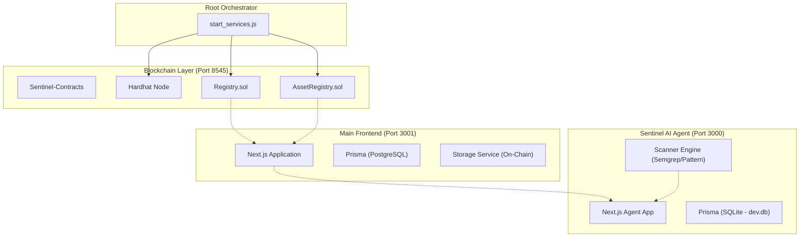

# 🛡️ Sentinel AI & Auto-ID Blockchain System: Architecture Deep Dive

This document provides a complete, file-by-file breakdown of the entire V5 ecosystem. It details the architecture, component interaction, and the logic behind the isolation strategy.

---

## 🏗️ High-Level Architecture

The system is divided into three completely isolated environments to prevent dependency conflicts, database locks, and port collisions.

---

## 📂 Directory & File Map

### 1. Root & Orchestration
| File | Description |
| :--- | :--- |
| `start_services.js` | The central brain. Spawns and manages the Frontend and Agent processes. Injects `TURBOPACK=0` to force Webpack stability. |
| `package.json` | Root dependencies and the `npm start` command. |
| `TESTING_AND_RUNNING.md` | Core instructions for manual deployment and testing. |
| `walkthrough.md` | Record of all major architecture changes and manual sync instructions. |

### 2. ⛓️ Sentinel-Contracts (Blockchain)
*Located at `d:\MAJOR PROJECT\V5\Sentinel-Contracts`*

| File | Description |
| :--- | :--- |
| `contracts/Registry.sol` | Manages Bounty and Report lifecycle. Features Auto-ID increments. |
| `contracts/AssetRegistry.sol` | Tracks scanned assets and their security status on-chain. |
| `scripts/deploy.js` | Hardhat script to deploy contracts to the local node. |
| `hardhat.config.js` | Configuration for the Ethereum development environment. |

### 3. 🌐 Frontend (Main DApp)
*Located at `d:\MAJOR PROJECT\V5\frontend` (Port 3001)*

| File | Purpose |
| :--- | :--- |
| `app/page.tsx` | Landing page of the ecosystem. |
| `app/bounties/create/page.tsx` | Multi-step Premium UI for creating bounties with Auto-ID. |
| `app/submit/page.tsx` | Card-based selector for submitting reports to specific bounties. |
| `lib/blockchain.ts` | Ethers.js integration for interacting with `Registry.sol`. |
| `lib/storage.ts` | Logic to convert between Smart Contract data and Frontend state. |
| `prisma/schema.prisma` | Connects to PostgreSQL for caching metadata and non-critical data. |
| `middleware.ts` | Handles authentication and path protection for the main app. |

### 4. 🤖 V5-Agent (Sentinel AI)
*Located at `d:\MAJOR PROJECT\V5\V5-Agent` (Port 3000)*

| File | Purpose |
| :--- | :--- |
| `prisma/schema.prisma` | **Isolated SQLite Schema**. Uses `provider = "sqlite"` to avoid DB locks. |
| `src/lib/scanner.ts` | The core AI scanning engine. Orchestrates Semgrep and Pattern analysis. |
| `src/lib/auth.ts` | **Isolated Auth**. Uses `agent_session` cookie to prevent conflicts with Port 3001. |
| `src/app/dashboard/assets/page.tsx` | Real-time scan tracking for perimeter assets. |
| `src/app/dashboard/vulnerabilities/page.tsx` | Deep-link analysis of security findings. |
| `src/middleware.ts` | Protected routes for the Agent dashboard. Checks `agent_session`. |
| `.env` | Local configuration (SQLite path, local Secrets). |

---

## ⚡ System Logic & Flow

### 1. Bounty Creation Flow
- **Input**: User enters project details (Name, Reward, Scale).
- **Auto-ID**: The system queries the Smart Contract's `bountyCount` to pre-determine the next ID.
- **On-Chain**: A transaction is sent to `Registry.sol`.
- **Validation**: Once confirmed, the UI shows a premium success animation.

### 2. Isolation Strategy (The "Why")
- **Database**: The Agent uses SQLite (`dev.db`) because it often performs heavy writes during scans. Shared Postgres was causing race conditions.
- **Cookies**: Renamed the Agent's cookie to `agent_session`. This allows you to stay logged into the Frontend (Port 3001) and Agent (Port 3000) simultaneously without being kicked out.
- **Turbopack**: Disabled for the Agent because the current Turbopack engine in Next.js 16 (beta/early) was crashing during deep dependency scans.

### 3. Current Working State
- **Frontend**: Full Premium UI, manual sync required (Hardhat node -> Deploy -> Start).
- **Agent**: Fully isolated data layer. Requires a separate login/signup from the frontend.
- **Sync**: Both sites successfully pull data from the same Hardhat node (Contract Layer).
