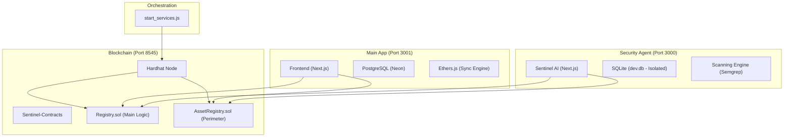

# 🛡️ V5 Ecosystem: Full Project Master Guide & Architecture

This document is the absolute source of truth for the **Sentinel AI & Auto-ID Blockchain System**. It explains the purpose of every significant file, the overall architecture, and how the components interact.

---

## 🏗️ System Architecture Overview

The V5 ecosystem is a triad of isolated services designed for stability and high-performance security analysis.

### 🧠 Core Philosophy: Isolation for Reliability
1.  **Process Isolation**: Agent and Frontend run in separate Node.js processes.
2.  **Database Isolation**: The Agent previously locked the main DB. It now uses a dedicated **SQLite** instance (`V5-Agent/prisma/dev.db`).
3.  **Cookie Separation**: Agent uses `agent_session` to prevent logging you out of the main site at `localhost`.
4.  **Stability**: **Turbopack is DISABLED** (`TURBOPACK=0`) to ensure 100% build reliability on Windows.

---

## 📂 File-by-File Breakdown

### 1. Root Directory & Orchestration
| File | Role |
| :--- | :--- |
| `start_services.js` | **The Master Orchestrator**. Automates port cleaning, process spawning, and log aggregation. It ensures all services start with the correct environment variables. |
| `package.json` | Defines root-level commands like `npm start`. |
| `PROJECT_ARCHITECTURE_DEEP_DIVE.md` | Summary of the system structure. |
| `PROJECT_MASTER_GUIDE.md` | (This file) The complete map of the project. |
| `walkthrough.md` | Audit trail of major architectural shifts and manual setup steps. |

---

### 2. ⛓️ Sentinel-Contracts (Blockchain Layer)
*Path: `/Sentinel-Contracts`*

| File | Purpose |
| :--- | :--- |
| `contracts/Registry.sol` | Core logic for Bounties and Reports. Handles the Auto-ID counter on-chain. |
| `contracts/AssetRegistry.sol` | Stores security metadata for scanned assets (domains, repos) on-chain. |
| `scripts/deploy.js` | Automated deployment script to push contracts to your local Hardhat node. |
| `hardhat.config.js` | Hardhat network configuration. |
| `addresses.json` | (Generated) Stores the deployed contract addresses used by the Frontend and Agent. |

---

### 3. 🌐 Frontend (Main Platform)
*Path: `/frontend`*

| File | Purpose |
| :--- | :--- |
| `app/page.tsx` | High-conversion landing page with system status indicators. |
| `app/bounties/create/page.tsx` | Complex UI for defining bounty scopes. Integrates with on-chain Auto-ID. |
| `app/submit/page.tsx` | Interaction point for researchers to link reports to active bounties. |
| `lib/blockchain.ts` | The bridge between the Web UI and the Smart Contracts. |
| `lib/storage.ts` | Synchronization logic that keeps the local DB in sync with blockchain events. |
| `prisma/schema.prisma` | PostgreSQL schema for user profiles, metadata, and caching. |
| `next.config.ts` | Standard Next.js configuration. |

---

### 4. 🤖 V5-Agent (Sentinel AI Dashboard)
*Path: `/V5-Agent`*

| File | Purpose |
| :--- | :--- |
| `prisma/schema.prisma` | **Isolated SQLite Schema**. Defines `User`, `Scan`, and `Finding` models. |
| `src/middleware.ts` | **Session Protection**. Specifically looks for the `agent_session` cookie. |
| `src/lib/auth.ts` | Authentication library. Renamed all cookie interactions to `agent_session`. |
| `src/lib/db.ts` | Database bridge. Includes a robust **Mock Fallback** if the DB isn't yet initialized. |
| `src/lib/scanner.ts` | The "Brain". Triggers CLI tools (Semgrep) or manual patterns to scan code. |
| `src/app/dashboard/page.tsx` | Main stats overview (Critical issues, Agent confidence). |
| `src/app/dashboard/assets/page.tsx` | Explorer for all verified perimeter assets. |
| `src/app/dashboard/vulnerabilities/page.tsx` | Searchable database of identified security flaws. |
| `.env` | Local secrets (JWT_SECRET) and the hardcoded SQLite path. |

---

## 🛠️ Operational Guide

### 1. How to Start Everything
The "Clean" way to run the system:
1.  Open Terminal A: `npx hardhat node` (in `Sentinel-Contracts`)
2.  Open Terminal B: `npx hardhat run scripts/deploy.js --network localhost` (in `Sentinel-Contracts`)
3.  Open Terminal C: `npm start` (in Root)

### 2. Login Logic
- **Frontend (3001)**: Use your standard account.
- **Agent (3000)**: Since the database is isolated for security, you must **Sign Up** again on the Agent side. This keeps your scanning data completely separate from your main account.

---

## ⚡ Troubleshooting Loops
If the UI "loops" or redirects unexpectedly:
- **Cookie Conflict**: Hard-refresh (`Ctrl + Shift + R`) to clear `localhost` cookies.
- **DB Init**: If `db push` fails, the Agent will fallback to **Mock Mode**. You'll still see data, but it won't persist after a restart until the SQLite file is generated.
- **Ports**: The orchestrator automatically kills processes sitting on 3000/3001 to prevent "Port already in use" errors.
